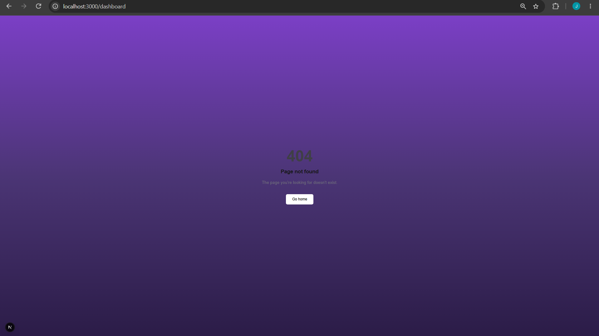
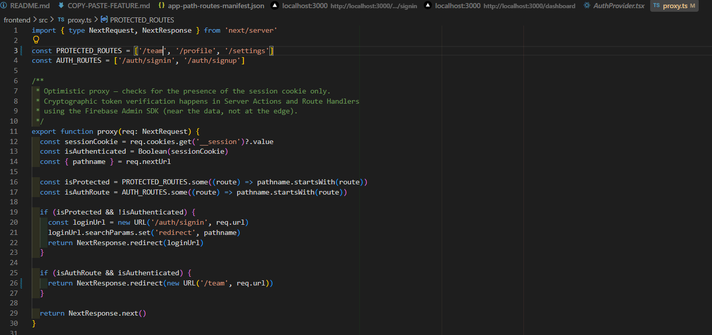

Task 5:
THough testing a successful login to the teampage, there was a significant bug which stopped all progress. Which was a set route was created for when a session was established, 
this cause an error as the route was to the dashboard page which isn't in the repo anymore:

After searching through the code to find where the default routes where, it was located in proxy.ts. The code was changed from /dashboard to /team, and now the login > redirect > teampage works successfully.

