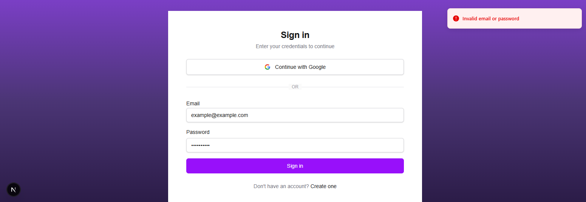
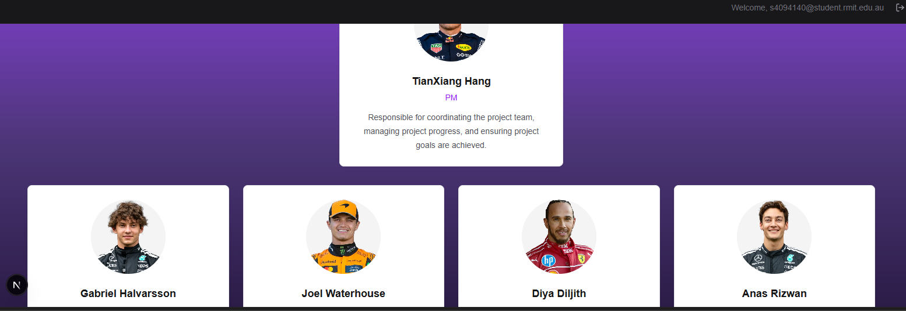
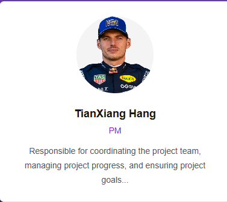

1. invalid login:

2. direct to teampage
After initial log in, the browser remembers your log in creditionals and takes user straight to teampage without logging in again

3. Missing photo

4. Unusally long blurb
